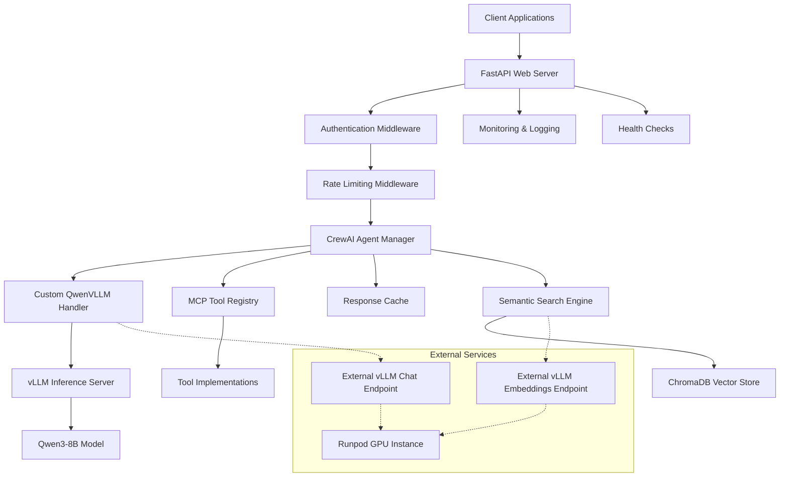
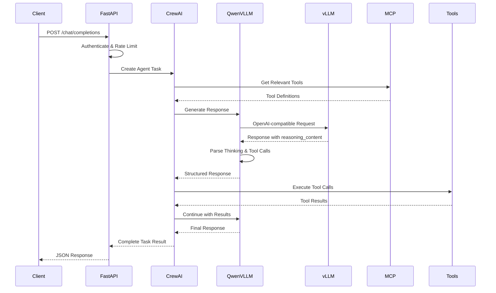

# Design Document

## Overview

The LLM Agent Backend is a production-grade asynchronous service that provides intelligent chat interactions through a CrewAI-orchestrated agent powered by vLLM-served Qwen3-8B-AWQ models. The system follows a modular architecture with clear separation of concerns: FastAPI handles HTTP requests, CrewAI manages agent orchestration, vLLM provides high-performance inference, and MCP enables extensible tool integration.

The design prioritizes performance optimization through KV cache utilization, semantic tool selection, and asynchronous processing. The system maintains OpenAI API compatibility for future extensibility while implementing custom logic to handle Qwen3's unique "thinking mode" capabilities for transparent reasoning.

## Architecture

### High-Level Architecture



### Component Interaction Flow



## Components and Interfaces

### 1. FastAPI Web Server

**Purpose:** HTTP API layer providing OpenAI-compatible endpoints with authentication, rate limiting, and request validation.

**Key Interfaces:**
- `POST /v1/chat/completions` - Main chat endpoint
- `GET /health` - Health check endpoint
- `GET /metrics` - Prometheus metrics endpoint

**Implementation Details:**
- Async request handlers using `asyncio`
- Pydantic models for request/response validation
- Middleware for authentication, rate limiting, and CORS
- Structured logging with correlation IDs
- Graceful shutdown handling

### 2. CrewAI Agent Manager

**Purpose:** Orchestrates agent behavior, manages task lifecycle, and coordinates between LLM and tools.

**Key Components:**
- `AgentManager` - Singleton managing agent instances
- `TaskProcessor` - Handles individual chat requests
- `ToolRegistry` - Manages MCP tool discovery and registration

**Configuration:**
```python
agent = Agent(
    role="Intelligent Assistant",
    goal="Provide helpful and accurate responses using available tools",
    backstory="Expert AI assistant with access to various tools and capabilities",
    llm=custom_qwen_llm,
    tools=dynamic_tool_list,
    verbose=True
)
```

### 3. Custom QwenVLLM Handler

**Purpose:** Custom CrewAI BaseLLM implementation that handles Qwen3's thinking mode and reasoning content.

**Key Features:**
- Inherits from `crewai.BaseLLM`
- Parses `reasoning_content` field from vLLM responses
- Separates thinking text from final answers
- Maintains OpenAI API compatibility
- Implements connection pooling and retry logic

**Interface:**
```python
class QwenVLLM(BaseLLM):
    async def call(self, messages: List[Dict], tools: Optional[List] = None) -> Dict
    def supports_function_calling(self) -> bool
    async def _make_request(self, payload: Dict) -> Dict
    def _parse_response(self, response: Dict) -> Tuple[str, Optional[str]]
```

### 4. vLLM Inference Server

**Purpose:** High-performance model serving with OpenAI-compatible API and Qwen3-specific parsing.

**Configuration:**
```bash
vllm serve Qwen/Qwen3-8B-AWQ \
    --enable-reasoning \
    --reasoning-parser qwen3 \
    --enable-auto-tool-choice \
    --tool-call-parser hermes \
    --max-model-len 8192 \
    --gpu-memory-utilization 0.9 \
    --quantization awq
```

**Connection Management:**
- Support for both local and external endpoints
- Connection pooling with `aiohttp.ClientSession`
- Automatic retry with exponential backoff
- Health monitoring and circuit breaker pattern

### 5. MCP Tool Integration

**Purpose:** Dynamic tool discovery and registration using Model Context Protocol.

**Architecture:**
- `MCPRegistry` - Discovers and manages MCP servers
- `ToolAdapter` - Converts MCP tools to CrewAI format
- `SemanticSelector` - Uses embeddings to select relevant tools

**Tool Discovery Flow:**
1. Scan MCP configuration files
2. Connect to MCP servers
3. Retrieve tool definitions
4. Convert to CrewAI tool format
5. Register with agent

### 6. Semantic Search Engine with ChromaDB

**Purpose:** Optimize inference by dynamically selecting relevant tools and managing context using ChromaDB vector database.

**Components:**
- ChromaDB PersistentClient for vector storage
- vLLM Embeddings API for Qwen3-Embedding-0.6B model
- 1024-dimensional vector embeddings via OpenAI-compatible API
- Similarity search for tool selection
- Context window management
- Token usage optimization

**Architecture:**
```python
class SemanticSearchEngine:
    def __init__(self, persist_directory: str, embedding_base_url: str):
        self.client = chromadb.PersistentClient(path=persist_directory)
        self.collection = self.client.get_or_create_collection(
            name="tool_embeddings",
            metadata={"hnsw:space": "cosine"}
        )
        self.embedding_base_url = embedding_base_url  # External vLLM embedding server
        self.embedding_model = "Qwen/Qwen3-Embedding-0.6B"
        self.embedding_dim = 1024
        self.http_session = None  # aiohttp.ClientSession for API calls
    
    async def add_tool_embeddings(self, tools: List[Tool]) -> None
    async def search_relevant_tools(self, query: str, n_results: int = 5) -> List[Tool]
    async def update_tool_embedding(self, tool_id: str, embedding: List[float]) -> None
    async def generate_embedding(self, text: str) -> List[float]  # Via aiohttp to vLLM API
```

## Data Models

### Request/Response Models

```python
class ChatCompletionRequest(BaseModel):
    messages: List[ChatMessage]
    model: str = "Qwen/Qwen3-8B-AWQ"
    temperature: float = 0.6
    max_tokens: Optional[int] = None
    tools: Optional[List[Tool]] = None
    thinking_mode: bool = True

class ChatCompletionResponse(BaseModel):
    id: str
    object: str = "chat.completion"
    created: int
    model: str
    choices: List[Choice]
    usage: TokenUsage
    thinking_content: Optional[str] = None

class Choice(BaseModel):
    index: int
    message: ChatMessage
    finish_reason: str

class ChatMessage(BaseModel):
    role: str
    content: str
    tool_calls: Optional[List[ToolCall]] = None
```

### Internal Models

```python
class AgentTask(BaseModel):
    id: str
    messages: List[ChatMessage]
    tools: List[Tool]
    config: AgentConfig
    created_at: datetime
    status: TaskStatus

class ToolExecutionResult(BaseModel):
    tool_name: str
    arguments: Dict[str, Any]
    result: Any
    execution_time: float
    success: bool
    error: Optional[str] = None
```

## Error Handling

### Error Categories

1. **Client Errors (4xx)**
   - Invalid request format
   - Authentication failures
   - Rate limit exceeded
   - Unsupported model

2. **Server Errors (5xx)**
   - vLLM connection failures
   - Tool execution errors
   - Internal processing errors
   - Resource exhaustion

### Error Response Format

```python
class ErrorResponse(BaseModel):
    error: ErrorDetail
    request_id: str
    timestamp: str

class ErrorDetail(BaseModel):
    type: str
    code: str
    message: str
    details: Optional[Dict[str, Any]] = None
```

### Retry and Circuit Breaker Logic

- Exponential backoff for transient failures
- Circuit breaker for vLLM endpoint health
- Graceful degradation when tools are unavailable
- Fallback responses for critical failures

## Testing Strategy

### Unit Testing

**Scope:** Individual components and functions
- Custom QwenVLLM handler logic
- Request/response parsing
- Tool registry operations
- Authentication and rate limiting

**Framework:** pytest with async support
**Coverage Target:** 90%+

### Integration Testing

**Scope:** Component interactions
- FastAPI + CrewAI integration
- vLLM communication
- MCP tool execution
- End-to-end request flow

**Test Environment:** 
- Mock vLLM server for consistent responses
- Test MCP servers with sample tools
- Containerized test environment

### Performance Testing

**Scope:** Load and stress testing
- Concurrent request handling
- Memory usage under load
- Response time benchmarks
- Resource utilization monitoring

**Tools:** 
- `locust` for load testing
- `pytest-benchmark` for performance regression
- Custom metrics collection

### Container Testing

**Scope:** Deployment and runtime validation
- Docker image builds for ARM64 and AMD64
- Container startup and health checks
- Environment variable configuration
- Resource limit compliance

**Test Matrix:**
- Local development environment
- AWS t4g (ARM64) instances
- External vLLM endpoints (Runpod)

## Performance Optimizations

### Inference Optimization

1. **KV Cache Utilization**
   - Request batching for similar contexts
   - Conversation state management
   - Cache warming strategies

2. **Token Management**
   - Dynamic context truncation
   - Semantic tool selection to reduce prompt size
   - Response caching for repeated queries

3. **Connection Optimization**
   - HTTP/2 connection pooling
   - Keep-alive connections to vLLM
   - Request pipelining where possible

### Asynchronous Processing

1. **Request Handling**
   - Non-blocking I/O throughout the stack
   - Async context managers for resources
   - Background task processing

2. **Concurrency Control**
   - Semaphores for vLLM connection limits
   - Rate limiting with token bucket algorithm
   - Backpressure mechanisms

## Security Considerations

### Authentication and Authorization

- JWT token validation
- API key management
- Role-based access control for different endpoints

### Data Protection

- Request/response logging without sensitive data
- Secure environment variable handling
- TLS encryption for all external communications

### Rate Limiting and DoS Protection

- Per-client rate limiting
- Request size limits
- Connection timeout configurations
- Resource usage monitoring

## Monitoring and Observability

### Metrics Collection

**Application Metrics:**
- Request count and latency
- Token usage and costs
- Error rates by category
- Tool execution statistics

**System Metrics:**
- Memory and CPU usage
- Connection pool statistics
- Cache hit rates
- vLLM endpoint health

### Logging Strategy

**Structured Logging:**
- JSON format with correlation IDs
- Different log levels for different environments
- Separate thinking content logging for analysis

**Log Categories:**
- Request/response logs
- Error and exception logs
- Performance and timing logs
- Security and audit logs

### Health Checks

**Endpoint Health:**
- `/health` - Basic service health
- `/health/deep` - Full dependency check
- `/metrics` - Prometheus metrics endpoint

**Dependency Monitoring:**
- vLLM endpoint availability
- MCP server connectivity
- ChromaDB vector database health
- Response cache availability